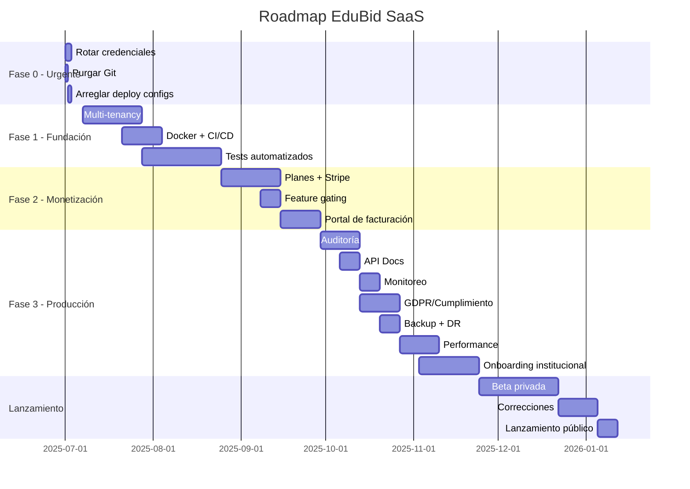

# Plan de Mejora y Madurez — EduBid

> Documento estratégico para llevar EduBid de un proyecto funcional a un SaaS institucional listo para producción.

---

## Diagnóstico actual

| Dimensión | Estado | Nota |
|-----------|--------|------|
| Arquitectura | ✅ Sólida | Django + DRF + React + JWT |
| Autenticación | ✅ Robusta | JWT + Google OAuth + email verification |
| UI/UX | ✅ Buena | Tailwind v4, dark mode, responsivo |
| Tests | ❌ Crítico | 0 tests en todo el proyecto |
| Seguridad secreta | ❌ Crítico | `.env` commiteado con credenciales reales |
| Multi-tenancy | ❌ Ausente | Sin modelo Institution ni aislamiento |
| Monetización | ❌ Ausente | Sin sistema de pagos/suscripciones |
| Deploy | ❌ Roto | Procfile y railway.toml referencian módulo inexistente |
| Monitoreo | ❌ Ausente | Sin Sentry, sin APM, sin logging estructurado |
| Documentación API | ❌ Ausente | Sin Swagger/OpenAPI |

---

## Fase 0 — Correcciones urgentes (1-2 días)

> Estas son fallas que **bloquean** cualquier uso en producción. Deben resolverse de inmediato.

### 0.1 Rotar credenciales comprometidas
- [ ] Cambiar `SECRET_KEY` de Django
- [ ] Cambiar contraseña de la base de datos MySQL
- [ ] Regenerar Google OAuth Client ID y Secret
- [ ] Cambiar contraseña del email SMTP
- [ ] Actualizar `.env` con nuevas credenciales
- [ ] Verificar que `.env` esté en `.gitignore`

### 0.2 Purgar secretos del historial de Git
```bash
# Instalar git-filter-repo
pip install git-filter-repo

# Purgar .env del historial completo
git filter-repo --path .env --path edubid-backend/.env --path edubid-frontend/.env --invert-paths

# Forzar push (requiere permisos de admin en el repo)
git push origin --force --all
```

### 0.3 Arreglar configuración de depliegue
- [ ] `Procfile`: corregir `Educoin.wsgi` → `edubid_core.wsgi`
- [ ] `railway.toml`: corregir referencia al módulo WSGI
- [ ] `railway_setup.sh`: eliminar referencia a `create_superuser.py` (no existe)
- [ ] Verificar que el build de Railway funcione correctamente

### 0.4 Limpiar dependencias fantasma
- [ ] Eliminar `next` de `package.json` (dependencia no utilizada, ~7.7MB)
- [ ] Eliminar `services/wallet.js` si no se usa (duplicado con `useWallet.js`)
- [ ] Eliminar `hooks/useCoins.js` si no se usa (duplicado con `useWallet.js`)

---

## Fase 1 — Fundación SaaS (1-2 meses)

> Construir la base multi-inquilino que permite que instituciones diferentes usen la misma instancia.

### 1.1 Multi-tenancy (Institution model)

```python
class Institution(BaseModel):
    nombre = models.CharField(max_length=255)
    slug = models.SlugField(unique=True)
    dominio = models.CharField(max_length=255, blank=True)
    logo = models.ImageField(upload_to="instituciones/", blank=True)
    activo = models.BooleanField(default=True)
    plan = models.CharField(max_length=20, choices=PLANES, default="trial")
    fecha_expiracion = models.DateTimeField(null=True, blank=True)
    config = models.JSONField(default=dict, blank=True)
```

**Cambios requeridos:**
- [ ] Agregar FK `institution` a todos los modelos principales (User, Classroom, Group, etc.)
- [ ] Agregar `InstitutionMiddleware` para aislar requests por tenant
- [ ] Modificar todas las queries para filtrar por `institution`
- [ ] Crear flujo de registro de institución (signup con datos de escuela)
- [ ] Crear flujo de invitación de usuarios (admin escuela → docentes → estudiantes)

**Estrategia de migración:**
- Agregar campo `institution` como nullable primero
- Migrar datos existentes a una institución por defecto
- Luego hacer NOT NULL

### 1.2 Docker + docker-compose

```yaml
# docker-compose.yml
services:
  db:
    image: mysql:8.0
    volumes: [mysql_data:/var/lib/mysql]
    environment:
      MYSQL_ROOT_PASSWORD: ${DB_PASSWORD}
      MYSQL_DATABASE: ${DB_NAME}

  backend:
    build: ./edubid-backend
    depends_on: [db]
    environment:
      DB_HOST: db
      DB_PORT: "3306"

  frontend:
    build: ./edubid-frontend
    ports: ["80:80"]
    depends_on: [backend]
```

- [ ] Crear `Dockerfile` para backend (Python + Gunicorn + WhiteNoise)
- [ ] Crear `Dockerfile` para frontend (Nginx + build estático)
- [ ] Crear `docker-compose.yml` para desarrollo
- [ ] Crear `docker-compose.prod.yml` para producción
- [ ] Crear script de entrypoint con migraciones automáticas

### 1.3 CI/CD (GitHub Actions)

```yaml
# .github/workflows/ci.yml
name: CI
on: [push, pull_request]
jobs:
  test:
    runs-on: ubuntu-latest
    services:
      mysql: [image: mysql:8.0, env: {MYSQL_ROOT_PASSWORD: test, MYSQL_DATABASE: test}]
    steps:
      - uses: actions/checkout@v4
      - name: Run tests
        run: |
          pip install -r requirements.txt
          python manage.py test

  deploy:
    needs: test
    if: github.ref == 'refs/heads/main'
    runs-on: ubuntu-latest
    steps:
      - name: Deploy to Railway
        run: railway up
```

- [ ] Crear workflow de CI (lint + test)
- [ ] Crear workflow de CD (deploy automático)
- [ ] Agregar badges al README

### 1.4 Tests automatizados

**Prioridad de tests por módulo:**

1. **Auth/Users** — registro, login, Google OAuth, email verification, password reset
2. **Tokens/Wallet** — creación de wallet, depósitos, bloqueo, transacciones
3. **Auctions** — crear subasta, pujar, aumentar, cerrar, reembolsos
4. **Grades** — calificar, cálculo de monedas, señales
5. **Groups/Classrooms** — CRUD, join codes, periodos

**Stack recomendado:** `pytest` + `pytest-django` + `factory-boy`

```bash
pip install pytest pytest-django pytest-cov factory-boy
```

- [ ] Configurar `pytest-django` (crear `pytest.ini`)
- [ ] Escribir factories para modelos principales
- [ ] Tests de auth (cobertura mínima: registro, login, JWT refresh)
- [ ] Tests de wallet (crear wallet, depositar, bloquear, consultar saldo)
- [ ] Tests de subastas (crear, pujar, aumentar, cerrar, reembolsar)
- [ ] Tests de permisos (rol estudiante no puede hacer acciones de docente)
- [ ] Configurar cobertura mínima (80%+)

---

## Fase 2 — Monetización (1-2 meses)

> Sistema de suscripciones que permite cobrar a instituciones.

### 2.1 Modelo de suscripción

```python
class Plan(models.Model):
    nombre = models.CharField(max_length=100)  # Free, Pro, Enterprise
    slug = models.SlugField(unique=True)
    precio_mensual = models.DecimalField(max_digits=10, decimal_places=2)
    precio_anual = models.DecimalField(max_digits=10, decimal_places=2)
    max_estudiantes = models.IntegerField()
    max_docentes = models.IntegerField()
    max_grupos = models.IntegerField()
    features = models.JSONField(default=list)
    activo = models.BooleanField(default=True)

class Suscripcion(BaseModel):
    institution = models.ForeignKey(Institution, on_delete=models.CASCADE)
    plan = models.ForeignKey(Plan, on_delete=models.PROTECT)
    estado = models.CharField(max_length=20, choices=ESTADOS_SUSCRIPCION)
    stripe_subscription_id = models.CharField(max_length=255)
    fecha_inicio = models.DateTimeField()
    fecha_fin = models.DateTimeField()
    renovacion_automatica = models.BooleanField(default=True)
```

### 2.2 Integración Stripe

- [ ] Crear cuenta Stripe (producción + test)
- [ ] Implementar webhooks de Stripe (subscription created, updated, deleted, payment failed)
- [ ] Crear endpoints: `/api/billing/checkout/`, `/api/billing/portal/`, `/api/billing/webhook/`
- [ ] Feature gating por plan (ej: "subastas solo en plan Pro")
- [ ] Portal de facturación para administradores de institución
- [ ] Período de prueba gratuito (30 días)

### 2.3 Feature gating

```python
# Decorador/middleware para verificar acceso a features
def require_feature(feature_name):
    def decorator(view):
        def wrapper(request, *args, **kwargs):
            if not request.institution.tiene_feature(feature_name):
                return Response({"detail": "Actualiza tu plan para acceder"}, 402)
            return view(request, *args, **kwargs)
        return wrapper
    return decorator
```

- [ ] Definir features por plan
- [ ] Implementar middleware de verificación
- [ ] Mostrar en UI qué features están bloqueadas y cómo upgradear
- [ ] Endpoint de cambio de plan con prorrateo

---

## Fase 3 — Madurez de producción (2-3 meses)

> Lo que separa un proyecto funcional de un producto empresarial serio.

### 3.1 Auditoría y trazabilidad

- [ ] Integrar `django-simple-history` en modelos críticos:
  - `Wallet`, `CoinTransaction` (transacciones financieras)
  - `Grade` (cambios de notas)
  - `Auction`, `Bid` (actividad de subastas)
  - `User`, `Profile` (cambios de perfil)
- [ ] Logging estructurado (JSON logs para ingestion en Splunk/Datadog)
- [ ] Almacenar IP y user-agent en acciones sensibles

### 3.2 Documentación API

```bash
pip install drf-spectacular
```

- [ ] Integrar `drf-spectacular` (OpenAPI 3)
- [ ] Configurar Swagger UI en `/api/docs/`
- [ ] Documentar todos los endpoints con descripciones y ejemplos
- [ ] Generar colección de Postman/Insomnia

### 3.3 Monitoreo y alertas

- [ ] Integrar **Sentry** para errores en backend y frontend
- [ ] Configurar **logging** en producción (archivos rotativos + stdout JSON)
- [ ] Health check endpoint: `GET /api/health/` (DB, cache, servicios externos)
- [ ] Alertas de errores 5xx vía email/Slack
- [ ] Monitoreo de rendimiento: consultas lentas, endpoints lentos

### 3.4 Privacidad y cumplimiento (GDPR/LOPD)

- [ ] Crear página de **Términos y condiciones**
- [ ] Crear página de **Política de privacidad**
- [ ] Implementar banner de **consentimiento de cookies**
- [ ] Endpoint de **exportación de datos** del usuario (`GET /api/users/export-data/`)
- [ ] Endpoint de **eliminación de cuenta** con confirmación (ya existe parcialmente)
- [ ] Política de retención de datos (configurable por institución)
- [ ] Encriptación de datos sensibles en reposo

### 3.5 Backup y recuperación

- [ ] Script automatizado de backup de MySQL (`mysqldump`)
- [ ] Backup diario a almacenamiento externo (S3, Backblaze)
- [ ] Prueba de restauración mensual
- [ ] Documentar procedimiento de disaster recovery

### 3.6 Performance y escalabilidad

- [ ] Agregar **caching** con Redis:
  - Consultas frecuentes (listados de subastas, wallets)
  - Sesiones (si se escala horizontalmente)
  - Rate limiting en Redis en vez de en memoria
- [ ] Indexar consultas frecuentes en MySQL
- [ ] Optimizar queries N+1 (usar `select_related`, `prefetch_related`)
- [ ] Paginación consistente en todos los list endpoints
- [ ] Compresión de assets estáticos (ya implementado con WhiteNoise)
- [ ] CDN para assets estáticos en producción
- [ ] Load testing con Locust o k6 antes del lanzamiento

### 3.7 Onboarding institucional

- [ ] Flujo de registro para instituciones (nombre, dominio, admin)
- [ ] Importación masiva de estudiantes (CSV, Excel)
- [ ] Generación de códigos de acceso para estudiantes
- [ ] Tour guiado para primer uso
- [ ] Videos tutoriales embebidos
- [ ] Centro de ayuda / FAQ

---

## Costos estimados de infraestructura (SaaS)

| Recurso | Plan Free (1 inst.) | Plan Pro (10 inst.) | Plan Enterprise |
|---------|--------------------|--------------------|-----------------|
| Backend (Railway) | $5-10/mes | $20-50/mes | $100-200/mes |
| Base de datos (MySQL) | $7-15/mes | $15-30/mes | $50-100/mes |
| Frontend (Netlify) | Gratis | Gratis | $20-50/mes |
| Redis (cache) | - | $5-10/mes | $15-30/mes |
| Almacenamiento (S3) | Gratis | $5/mes | $20/mes |
| Monitoreo (Sentry) | Gratis | $25/mes | $100/mes |
| Email (SendGrid) | Gratis (100/día) | $20/mes | $90/mes |
| **Total estimado** | **~$20/mes** | **~$100/mes** | **~$500/mes** |

---

## Timeline recomendado



---

## Checklist de lanzamiento

### Seguridad
- [ ] No hay secretos en el repositorio
- [ ] HTTPS forzado en producción
- [ ] HSTS configurado
- [ ] Rate limiting por endpoint
- [ ] Validación de entrada en todos los endpoints
- [ ] SQL injection prevention (Django ORM, verificado)
- [ ] XSS prevention (React, verificado)
- [ ] CSRF protection activa
- [ ] CORS configurado solo para dominios permitidos

### Infraestructura
- [ ] Docker compose funcional
- [ ] CI/CD pipeline operativo
- [ ] Backups automáticos configurados
- [ ] Health check endpoint implementado
- [ ] Logging estructurado
- [ ] Monitoreo de errores (Sentry)
- [ ] Escalamiento horizontal posible (stateless backend)

### Producto
- [ ] Tests con cobertura > 80%
- [ ] Documentación de API completa
- [ ] Términos y condiciones publicados
- [ ] Política de privacidad publicada
- [ ] Flujo de registro de institución funcional
- [ ] Sistema de pagos integrado y probado
- [ ] Onboarding de nuevos usuarios documentado
- [ ] Planes y precios definidos

### Legal
- [ ] Contrato de términos de servicio
- [ ] Política de privacidad (GDPR/LOPD compliant)
- [ ] Política de cookies
- [ ] DPA (Data Processing Agreement) para instituciones
- [ ] Aviso legal con datos del responsable

---

## Arquitectura objetivo (post-mejoras)

```
┌─────────────────────────────────────────────────────────┐
│                     CDN (Cloudflare)                      │
├──────────────────────┬──────────────────────────────────┤
│   Frontend (Netlify)  │   API (Railway / AWS / GCP)      │
│   React + Vite        │   Django + DRF + Gunicorn        │
│   Tailwind CSS        │   WhiteNoise (static)            │
│                       │                                  │
│   Dominio:            │   Subdominio por institución:    │
│   app.edubid.com      │   escuela.edubid.com/api/        │
├──────────────────────┴──────────────────────────────────┤
│                      Redis (cache + sesiones)             │
├──────────────────────┬──────────────────────────────────┤
│       MySQL 8.0       │     S3 / Backblaze (backups)     │
│   (Railway / RDS)     │                                  │
├──────────────────────┴──────────────────────────────────┤
│              Stripe (pagos + facturación)                 │
├─────────────────────────────────────────────────────────┤
│       Sentry (errores) + SendGrid (emails)               │
└─────────────────────────────────────────────────────────┘
```

---

## Notas finales

1. **Prioridad absoluta**: Las credenciales commiteadas. Si el repo es público, ya están comprometidas.
2. **Multi-tenancy temprano**: Entre más crezca el código, más difícil será agregarlo. Hazlo ahora.
3. **Tests primero**: No implementes nuevas features sin tests. El código sin tests es deuda técnica garantizada.
4. **Stripe lo antes posible**: El feature gating y los planes deben existir desde el día 1 para condicionar la arquitectura.
5. **Itera con una institución real**: Consigue una escuela piloto que use el producto gratis a cambio de feedback. El feedback real vale más que cualquier plan.

---

*Última actualización: Julio 2025*
