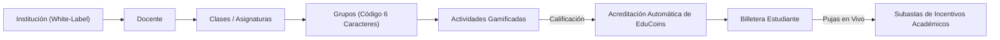

# 🚀 EduBid — Estado Actual del Proyecto y Hoja de Ruta (Roadmap)

> **Documento Oficial de Arquitectura, Registro de Logros y Próximos Pasos**  
> *Última actualización:* Septiembre 2026 | *Versión de la plataforma:* 2.4.0 (Angular 19 + Django 5.2)

---

## 📌 1. Resumen Ejecutivo de la Plataforma

**EduBid** es un ecosistema educativo SaaS Multi-Tenant diseñado para transformar la dinámica del aula mediante una microeconomía meritocrática basada en **EduCoins** y **Subastas Académicas formativas**.



---

## ✅ 2. Registro Exhaustivo de lo Implementado

### 🔐 2.1 Autenticación, Sesión y Seguridad (Frontend & Backend)
1. **Autenticación Híbrida**: JWT (SimpleJWT) con rotación y revocación segura de tokens, combinada con **Google OAuth 2.0**.
2. **Unificación en Landing Page**:
   - Integración de los formularios de inicio de sesión y registro directamente en el `HomeComponent`.
   - Soporte para rutas `/login` y `/register` como alias directos al Home, eliminando duplicidad de código.
3. **Flujo de Verificación de Correo Resiliente**:
   - `VerifyEmailComponent` enriquecido con manejo de tokens inválidos o expirados, modal interactivo de reenvío y retroalimentación clara.
   - Corregidos errores de redirección 404 en el endpoint `/api/users/verify-email/<token>/`.
4. **Experiencia de Cierre de Sesión (Logout)**:
   - **Modal de Confirmación**: Al pulsar "Cerrar Sesión", se solicita confirmación explícita al usuario para prevenir desconexiones accidentales.
   - **Pantalla de Carga (Loading Screen)**: Overlay de pantalla completa con animación orbital, isotipo de EduBid y mensaje informativo (*"Cerrando sesión en EduBid... Restableciendo preferencias y redirigiendo al inicio"*).
   - **Reseteo Estilístico Completo**: Invocación de `ThemeService.resetBrandColors()` que elimina todas las variables `--brand-*` del DOM.
   - **Hard-Refresh Automático**: Redirección mediante recarga limpia (`window.location.href = '/'`) que garantiza que los colores institucionales no permanezcan precargados en memoria.
5. **Corrección de Checkbox de Términos**:
   - Corrección visual y de contraste en modo claro y modo oscuro para la casilla de aceptación de términos y condiciones en el registro.

---

### 🎨 2.2 Identidad Visual, White-Labeling y UI/UX
1. **Paleta Institucional Completa**:
   - Selector cromático en `InstitutionBrandingComponent` con 24 colores principales y degradados predefinidos con nombres en español.
2. **Contraste Dinámico Inteligente (YIQ Luminance)**:
   - Cálculo automático de luminancia en tiempo de ejecución: si el color institucional primario es claro, los textos sobre botones y badges conmutan dinámicamente a negro carbón (`#0a0a0a`) para garantizar accesibilidad WCAG AAA.
3. **Línea Superior del Header (Scroll Indicator)**:
   - Estilizada con degradado simétrico de **secundario $\rightarrow$ primario $\rightarrow$ secundario**:
     ```scss
     linear-gradient(90deg, var(--brand-accent) 0%, var(--brand-primary) 50%, var(--brand-accent) 100%)
     ```
4. **Scrollbars Personalizadas**:
   - Barra de desplazamiento personalizada con degradado institucional activo y soporte multi-navegador.
5. **Erradicación de Emojis y Redundancias**:
   - Sustitución de todos los emojis de la interfaz por iconos vectoriales SVG limpios y consistentes.
   - Eliminación de redundancias en botones (ej: antes decía `+ + Nueva Tarea`, ahora dice `Nueva Actividad` con un único icono `+`).

---

### 📚 2.3 Módulos Académicos y Pedagógicos

#### A. Aulas y Grupos (`/classrooms` y `/groups`)
* **Detalle de Clase (`ClassroomDetailComponent`)**:
  - Vista completa con pestañas para Grupos y Estudiantes matriculados.
  - Generación automática de código de acceso alfanumérico de 6 caracteres por grupo.
  - Botón de copia al portapapeles con feedback temporal (*¡Copiado!*).
* **Vista de Estudiantes (`StudentGroupsComponent`)**:
  - Panel para unirse a grupos ingresando el código proporcionado por el docente.
  - Visualización del saldo de EduCoins específico por grupo y período.

#### B. Actividades y Tareas (`/activities`)
* **Tipología sincronizada con el backend**: Reto, Misión, Proyecto y Evaluación.
* **Sustitución de XP por Calificación Real**: Las actividades evalúan notas (escala 0.0 - 5.0 o 0 - 100) y no "experiencia ficticia".
* **Acreditación Automática de EduCoins**:
  - Al calificar una entrega, el backend acredita automáticamente los EduCoins correspondientes a la billetera del estudiante según su calificación.
* **Entregas para Estudiantes**:
  - Modal para subir archivos adjuntos o proporcionar enlaces externos (GitHub, Drive, Figma).

#### C. Subastas en Tiempo Real (`/auctions`)
* **Contador Regresivo en Vivo**: Reloj sincronizado segundo a segundo con el cierre de la subasta.
* **Doble Sincronización en Tiempo Real**:
  - WebSockets activos vía `/ws/auctions/`.
  - Sondeo silencioso de respaldo cada 6 segundos (`AuctionsComponent`) que sincroniza automáticamente la puja más alta, el número de ofertas y el saldo disponible del estudiante sin requerir recargar la página.
* **Centro de Pujas con Retención**:
  - Validación de saldo disponible en la billetera del estudiante.
  - Retención temporal de EduCoins (`hold`) al pujar.
* **Cierre y Liquidación Automática**:
  - Al cerrar la subasta, se debita definitivamente al ganador y se reembolsa automáticamente a los demás participantes.
* **Restricción de Pujas Docentes**:
  - El docente no puede manipular saldos arbitrariamente; únicamente puede registrar una puja en nombre de un estudiante cuando este lo autorice expresamente (por carencia de dispositivo móvil en el aula).

#### D. Billetera Digital (`/wallet`)
* Desglose claro de **Saldo Total**, **Saldo Bloqueado en Subastas** y **Saldo Disponible**.
* Historial transaccional inmutable con filtros por tipo:
  - 🟢 Ganancias (`earn`) por actividades.
  - 🔴 Gastos (`spend`) por subastas ganadas.
  - 🟠 Retenciones (`hold`) por pujas activas.
  - 🔵 Reembolsos (`refund`) por pujas superadas.
* Vista de supervisión para docentes, coordinadores y rectores para monitorear billeteras de sus alumnos.

#### E. Calificaciones y Reportes Oficiales DANE (`/grades`)
* Boletín académico para estudiantes con promedio general y desglose de actividades.
* Generador de reportes consolidados para docentes, directivos y rectores por grupo escolar:
  - **Exportación a PDF**: Documento formal membretado con logo y colores institucionales, ajuste milimétrico a 540 pt útiles y saneamiento de títulos (eliminada redundancia *"Grupo Grupo"*).
  - **Exportación a Excel**: Planilla `.xlsx` (`openpyxl`) compatible con el formato estándar del Ministerio de Educación / DANE, formateo numérico homogéneo y anchos de columnas adaptativos.
  - **Blindaje de Tipos Numéricos**: Casteo explícito a `float` en promedios y agregaciones para prevenir incompatibilidades con `decimal.Decimal` provenientes de la base de datos.
  - **Permisos Institucionales Flexibles**: Soporte de descarga para Administradores, Docentes de la asignatura, Rectores y Coordinadores de la institución educativa.

#### F. Módulo de Perfil de Usuario (`/profile`)
* Componente standalone dedicado con tres pestañas:
  1. **Información Personal**: Edición de nombre, apellido, teléfono, dirección y biografía/especialidad pedagógica.
  2. **Seguridad y Contraseña**: Formulario reactivo para cambio de contraseña con visibilidad conmutable y validación de coincidencia.
  3. **Detalles Institucionales**: Consulta de institución, código DANE, rol oficial y reglas de la economía escolar.
* Enlace interactivo en la cabecera del layout haciendo clic en el avatar o nombre del usuario.

#### G. Notificaciones Interactivas y Dinamismo en Tiempo Real
* **Generación Automática por Eventos**: Señales automáticas en Django para calificaciones, actividades asignadas, pujas de subasta superadas, victorias en subastas y recargas de EduCoins.
* **Sondeo en Segundo Plano (Background Polling)**:
  - Ciclo de actualización cada 10 segundos en `InAppNotificationService`.
  - Supresión de toasts de error mediante header `X-Skip-Error-Toast` durante micro-cortes de red.
* **Alertas Emergentes Contextuales**:
  - Detección precisa de nuevas notificaciones incluso partiendo de 0 no leídas mediante la bandera `hasLoadedInitial`.
  - Animación de rebote (`animate-bounce`) en la campana del header y toast informativo flotante (`🔔 Titulo: Mensaje`).
* **Navegación Contextual al Clic**:
  - Al hacer clic en una notificación in-app, el sistema la marca como leída y redirige inmediatamente al recurso correspondiente (`/auctions`, `/activities`, `/grades`, `/wallet`, `/classrooms`, `/groups`, `/profile`).

---
 
## 🐘 3. Integración de Supabase (PostgreSQL) — Implementado y Operativo
 
La plataforma cuenta con soporte dual de base de datos totalmente implementado, operando con **Supabase (PostgreSQL en la Nube)** como motor primario y preservando compatibilidad transparente con MySQL local.
 
### 3.1 Estado de la Conexión a Supabase
1. **Infraestructura en la Nube**:
   - Conectado al clúster de Supabase vía AWS Session Pooler en el puerto `5432` con `sslmode=require`.
   - Las 37 tablas del modelo relacional (`institutions`, `users`, `classrooms`, `groups`, `activities`, `auctions`, `tokens`, `grades`, `notifications`, etc.) han sido migradas y validadas.
2. **Parámetros de Entorno (`.env`)**:
   ```env
   DB_ENGINE=django.db.backends.postgresql
   DB_NAME=postgres
   DB_USER=postgres.gowmeguvuignrlqakewx
   DB_PASSWORD=********
   DB_HOST=aws-0-us-east-1.pooler.supabase.com
   DB_PORT=5432
   DB_SSLMODE=require
   ```
3. **Conector Python**:
   - `psycopg2-binary==2.9.13` instalado y fijado en [requirements.txt](file:///home/ivnmtz09/Proyectos/edubid/edubid-backend/requirements.txt).
   - `edubid_core/settings.py` soporta dinámicamente tanto PostgreSQL/Supabase como MySQL con detección y aislamiento de excepciones para `pymysql`.
4. **Validación Exhaustiva**:
   - Suite de pruebas de Django ejecutada: **Ran 76 tests ... OK** (100% de tests aprobados).
 
### 3.2 Transferencia de Datos entre Entornos (MySQL <-> Supabase)
Si se requiere transferir datos de prueba existentes de MySQL a Supabase:
```bash
# 1. Exportar datos (con MySQL activo en .env)
python manage.py dumpdata --natural-foreign --natural-primary -e contenttypes -e auth.Permission --indent 2 > datos.json

# 2. Importar datos (con Supabase activo en .env)
python manage.py loaddata datos.json
```
 
---
 
## 🗺️ 4. Hoja de Ruta y Estado de Módulos
 
| Módulo / Característica | Estado | Responsable / Notas |
|-------------------------|--------|---------------------|
| **Migración a Supabase (PostgreSQL)** | ✅ Completado | Conexión pooler 5432, 37 tablas migradas y 76 tests OK |
| **Notificaciones Interactivas (Redirección)** | ✅ Completado | Implementado en `LayoutComponent` y backend signals |
| **Módulo de Perfil (`/profile`)** | ✅ Completado | Componente `ProfileComponent` y rutas operativas |
| **Integración de Supabase Storage (S3)** | ⏳ Planificado | Opcional para centralizar archivos de `media/` |
| **Regla de No-Bonificación Manual Arbitraria** | ✅ Asegurado | Monedas fluyen únicamente por actividades o pujas autorizadas |
| **WebSockets Heartbeat & Reconexión** | ⏳ Optimización | Reforzar reconexión automática en redes con pérdida de paquetes |
| **PWA / Notificaciones Push de Navegador** | 💡 Futuro | Soporte para Service Worker y notificaciones Push fuera del navegador |

---

## 🧪 5. Comandos de Verificación del Sistema

### Backend (Django)
```bash
cd edubid-backend
source .venv/bin/activate
python manage.py test apps
python manage.py runserver
```

### Frontend (Angular 19)
```bash
cd edubid-frontend
npm run build
npm start
```
